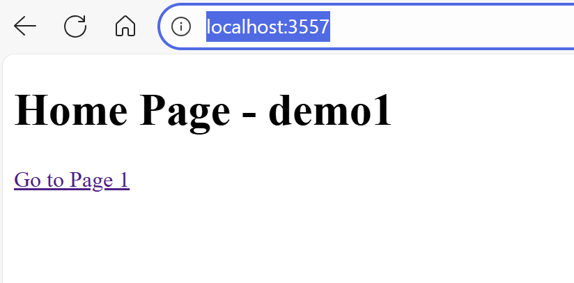
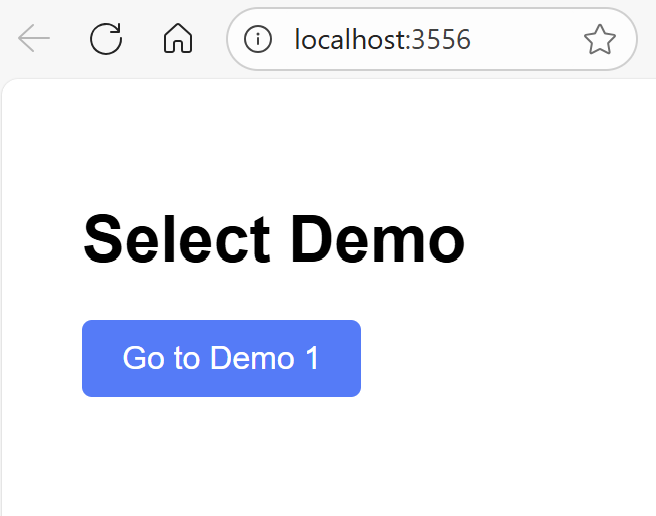
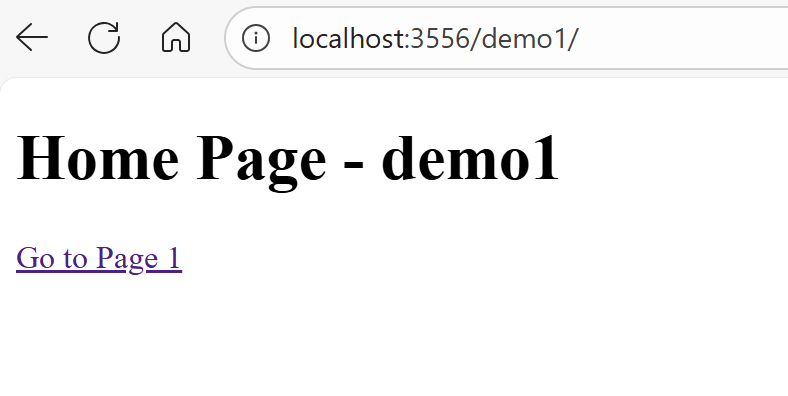

# go-app-base-href

Hosting go-app in base href sub folders

# build the wasm and static files.

```shell
make generate-static
```

This produces 2 outputs. One is a base line where I didn't change anything. The other is an attempt to host the wasm in a subfolder. i.e. localhost:3556/demo1/

# baseline

```shell
go run .\cmd\baseline_server_host\
```

[baseline host](http://localhost:3557/)



# base href

I am using a [base href resolver](./pkg/ResourceResolvers/BaseHRefResolver.go) to strip off the `/` prefix so that things work with

```go
		RawHeaders: []string{
			"<base href=\"/demo1/\">",
		},
```

```shell
go run .\cmd\href_server_host\
```

[base href host](http://localhost:3556/)

  

